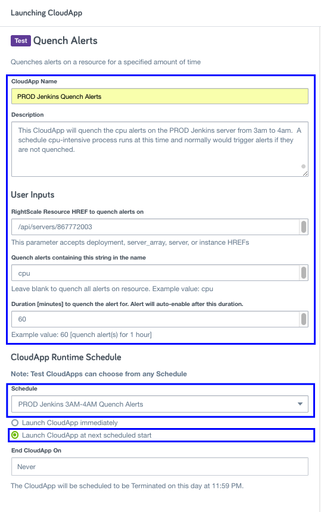
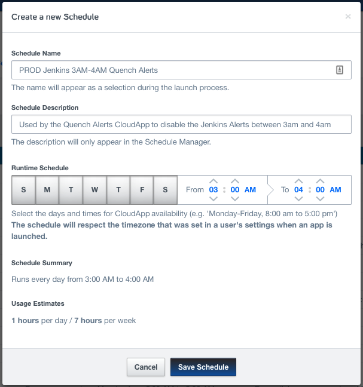

### Quench Alert Policy
**What it does**

This policy CAT will quench alerts defined under a RightScale resource [deployment, server_array, server, instance] for a specified amount of time.  The CloudApp has the ability to quench all alerts, or only those alerts that match a certain name [i.e. *cpu*]

**Scheduling when the policy runs**

To control the frequency that the policy CAT runs, you should [create a schedule and associate it with the CAT](http://docs.rightscale.com/ss/guides/ss_creating_schedules.html) in RightScale Self-Service.

Specify the days of the week/hours that you want the alerts to be quenched. For example, if you want the policy CAT to quench alerts every day at 3AM, specify a schedule similar to the one below. We recommend having the CloudApp launch a few minutes before the alerts need to be quenched to give the CloudApp time to audit and take the necessary action on discovered alerts.

**Cost**

This policy CAT does not launch any instances, and so does not incur any cloud costs.

