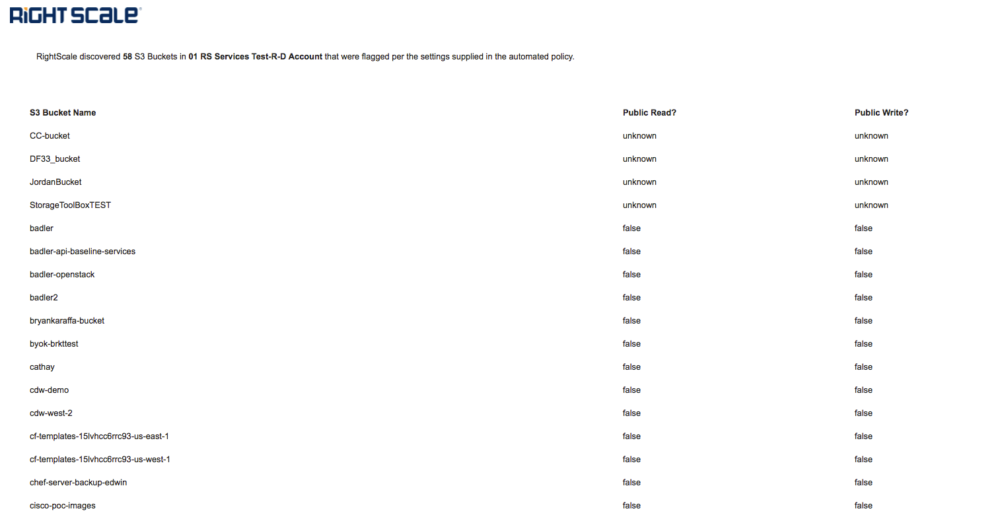

### S3 Bucket ACL Policy

**What it does**

This policy CAT will search your AWS account that is connected to the RightScale account where you are running the CAT. It will discover S3 Buckets that meet the parameter settings that you have selected.

This policy is useful to identify S3 Buckets whose public access permissions do not meet corporate standards.

You can choose to report on all S3 Buckets, Buckets that allow public READ access, and/or Buckets that allow public WRITE access. You can specify multiple email addresses that should be alerted and each email will receive a report with a list of S3 Buckets.

**Limitations**

S3 Buckets that include capital letters in their name do not meet AWS best practices for bucket naming, and as a result, the Bucket cannot be interacted with via the S3 API.  These buckets will continue to be listed on the **All Buckets** Report, but the Public Read & Public Write columns will indicate `unknown`.  It is highly recommended to migrate these buckets to newly named buckets without capital letters.

**Notifications (Email)**

The emails generated from the Policy are sent using a shared RightScale account of a free email service (mailgun). We have used a proxy, however, you may want to modify the CAT to use your own email service.

**Scheduling when the policy runs**

To control the frequency that the Policy CAT runs, you should [create a schedule and associate it with the CAT](http://docs.rightscale.com/ss/guides/ss_creating_schedules.html) in RightScale Self-Service.

Specify the days of the week that you want the CAT to run. For example, if you want the policy CAT to run once a week on Monday, specify a schedule of only Monday. For the hours you should specify approximately a 30 minute time window for the policy CAT to complete. (It should take less than 15 minutes to run).

**Cost**

This policy CAT does not launch any instances, and so does not incur any cloud costs.
