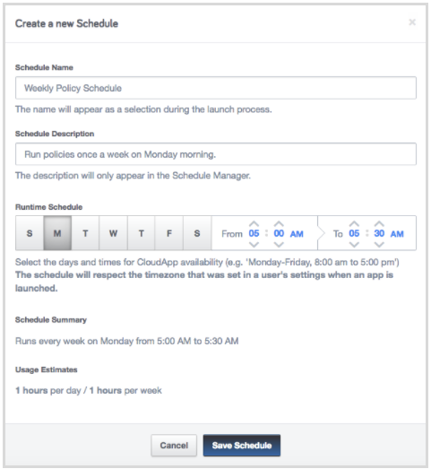

### Tag Checker Policy

**What it does**

Uses RightScale Cloud Language (RCL) to check all instances in an account for a given tag key and reports back which
servers or instances are missing the tag.

**Using Advanced Tags**

You can create a custom tag policy by using a JSON object that contains the tags, keys and validation value(s).  There are three options; string, regex and array.  You may include JSON in the field *Tags' Namespace:Keys Advanced List.* or provide a public url that contains your JSON.  The first key is the tag to match, each key has two other keys: validation-type is either array, string or regex.  validation includes the values the tag must contain.  If the tags and values are not on the server than the server will be reported in the email at the end of the cloudapp exectuion.  See example below.  

Example JSON:
```json
{
	"rs_agent:type": {
		"validation-type": "array",
		"validation": ["right_link_lite", "bar"]
	},
	"rs_login:state": {
		"validation-type": "string",
		"validation": "user"
	},
	"rs_id: user": {
		"validation-type": "regex",
		"validation": "^sp"
	}
}
```


**Scheduling when the policy runs**

To control the frequency that the policy CAT runs, you should [create a schedule and associate it with the CAT](http://docs.rightscale.com/ss/guides/ss_creating_schedules.html) in RightScale Self-Service.

Specify the days of the week that you want the CAT to run. For example, if you want the policy CAT to run once a week on Monday, specify a schedule of only Monday. For the hours you should specify approximately a 30 minute time window for the policy CAT to complete. (It should take less than 15 minutes to run).



**Cost**

This policy CAT does not launch any instances, and so does not incur any cloud costs.
