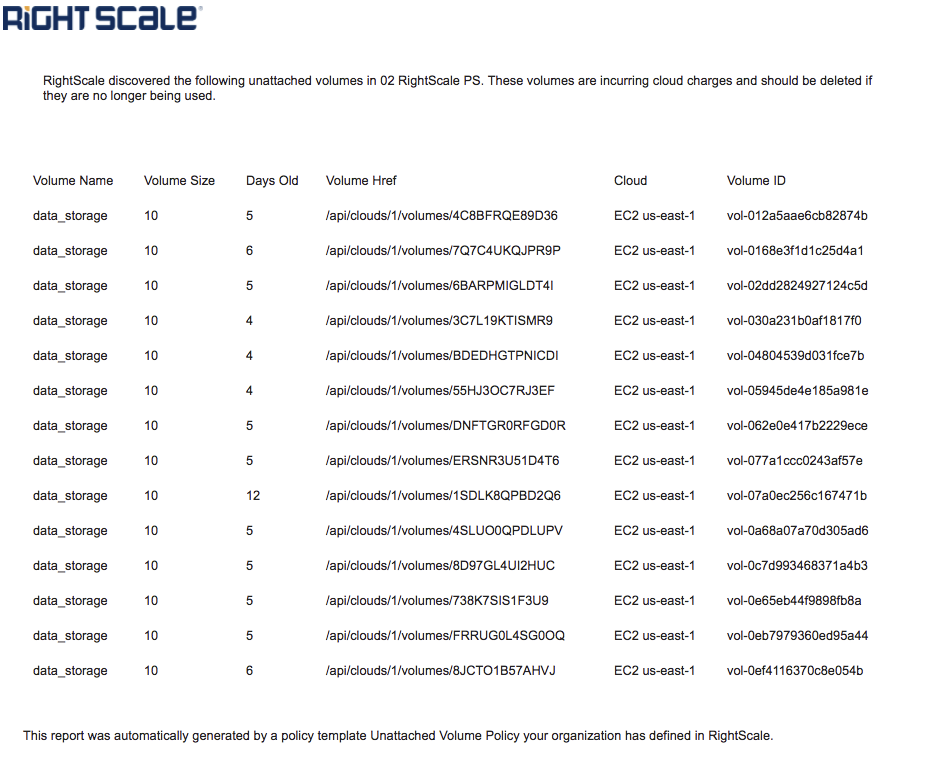
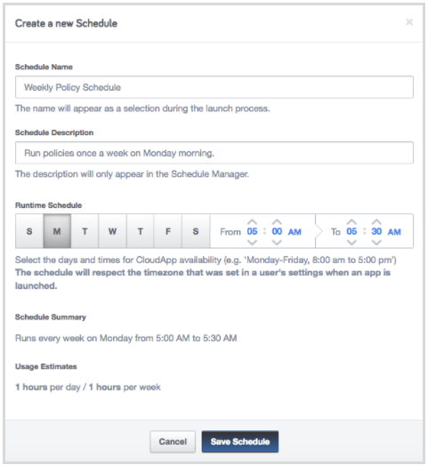

### Unattached Volume Finder

**What it does**

This policy CAT will search all your cloud accounts that are connected to the RightScale account where you are running the CAT. It will find unattached volumes that are have been unattached for longer than a specified number of days.

You can choose to **Alert only** or **Alert and Delete** the volumes. **_Warning: Deleted volumes cannot be recovered_**.  We strongly recommend that you **start with Alert only** so that you can review the list and ensure that the volumes should actually be deleted. You can specify multiple email addresses that should be alerted and each email will receive a report with a list of unattached volumes. **Note:** you will NOT receive an email if no unattached volumes are discovered. 

## Supported Clouds
The following clouds are supported: 
- AWS
- Azure Classic
- Azure Resource Manager
- Google 
- Openstack
- Rackspace
- Softlayer
- VMware

The emails in the sample CAT are sent using a shared RightScale account of a free email service (mailgun). We have used a proxy, however, you may want to modify the CAT to use your own email service.

**Scheduling when the policy runs**

To control the frequency that the policy CAT runs, you should [create a schedule and associate it with the CAT](http://docs.rightscale.com/ss/guides/ss_creating_schedules.html) in RightScale Self-Service.

Specify the days of the week that you want the CAT to run. For example, if you want the policy CAT to run once a week on Monday, specify a schedule of only Monday. For the hours you should specify approximately a 30 minute time window for the policy CAT to complete. (It should take less than 15 minutes to run).

**Cost**

This policy CAT does not launch any instances, and so does not incur any cloud costs.
